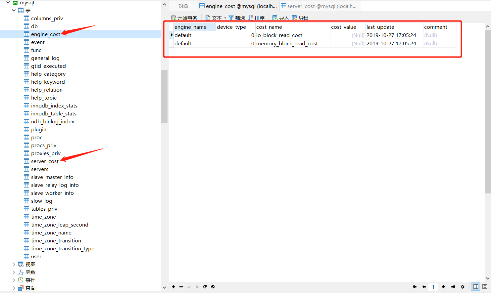
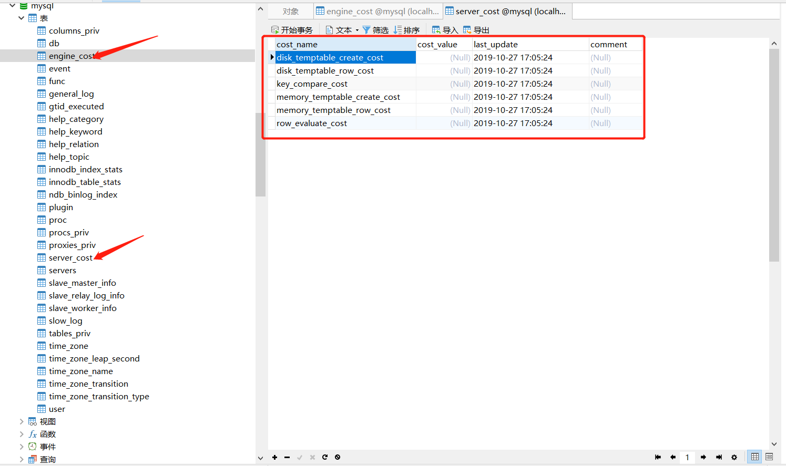
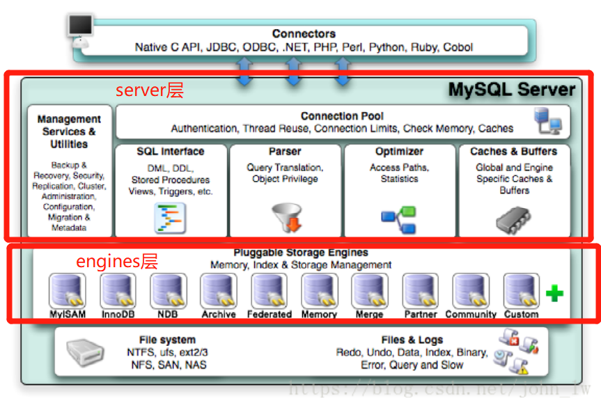
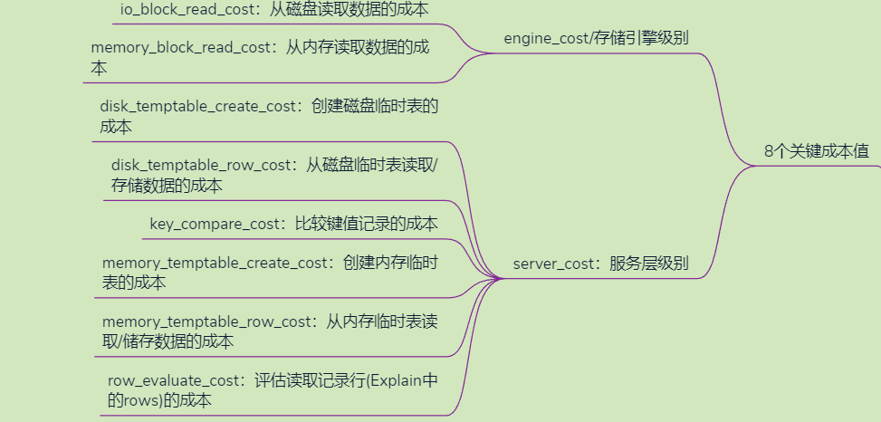

>本文来源于[官网](https://dev.mysql.com/doc/refman/5.7/en/cost-model.html)

# 优化器成本模型

为了生成执行计划，优化器使用**成本模型**，该模型基于对查询执行期间发生的各种操作的**成本**进行**估算**。优化器具有一组内置的默认“成本常数”，可用于制定有关执行计划的决策。我们可以通过修改这些内置的“成本常数”来改变执行决策。

优化器还有一个成本估算数据库，可在执行计划构建期间使用。这些估算值存储在系统数据库的`server_cost`和 `engine_cost`表中， `mysql`并且可以随时配置。这些表的目的是使得可以轻松调整优化器在尝试得出查询执行计划时使用的成本估算。





## 一、成本模型一般运作

可配置的优化器成本模型的工作方式如下：

- 服务器在启动时将成本模型表（即上边那两张表）读取到内存中，并在运行时使用内存中的值。表中指定的任何非空成本估算优先于相应的内置默认成本常数。任何空估计值都指示优化器使用编译后的默认值。
- 在运行时，服务器可以重新读取成本表。当动态加载存储引擎或`FLUSH OPTIMIZER_COSTS`执行语句时，会发生这种情况。
- 成本表使服务器管理员可以通过更改表中的条目轻松调整成本估算。通过将条目的成本设置为NULL，优化器使用内存中的成本值。对表的更改之后应该有`flush Optimizer_costs`才能生效。
- 客户会话开始时当前的内存成本估算在整个会话中都适用，直到结束为止。特别是，如果服务器重新读取成本表，则任何更改的估算值仅适用于随后启动的会话。现有会话不受影响。
- 成本表特定于给定的服务器实例。服务器不会将成本表更改复制到副本。

## 二、成本模型数据库

优化器成本模型数据库由`mysql`系统数据库中的两个表组成，其中包含查询执行期间发生的操作的成本估算信息：

- `server_cost`：针对一般服务器操作的优化器成本估算
- `engine_cost`：针对特定存储引擎的特定操作的优化器成本估算

MySQL架构中，分为server层和engines层所以成本模型基于这两个层次来估算。



### 1. **server_cost 表包含以下列**

- `cost_name`

  成本模型中使用的成本估算名称。名称不区分大小写。如果服务器在读取该表时无法识别成本名称，则会向错误日志中写入警告。

- `cost_value`

  成本估算值。如果该值不为空，则服务器将其用作成本值。否则，它将使用内存中默认估计值（编译值）。DBA可以通过更新此列来更改成本估算。如果服务器在读取此表时发现成本值无效（非正值），则会向错误日志中写入警告。

  要覆盖默认估算值，请将费用设置为非 `NULL `值。要恢复为默认值，请将值设置为`NULL`。然后执行`FLUSH OPTIMIZER_COSTS`以告知服务器重新读取成本表。

- `last_update`

  最后一行的更新时间。

- `comment`

  与成本估算相关的描述性评论，即备注。DBA可以使用此列来提供有关成本估算行为何存储特定值的信息。

**该`server_cost`表的主键是`cost_name`列，因此无法为任何成本估算创建多个条目。**

**`server_cost`中的`cost_name` 值：**

- `disk_temptable_create_cost`（默认为40.0），`disk_temptable_row_cost`（预设1.0）

  内部创建的临时表存储在基于磁盘的存储引擎(InnoDB或MyISAM)中的成本估算。增加这些值会增加使用内部临时表的成本估计，并使优化器更喜欢较少使用内部临时表的查询计划。

  与下边相应的内存参数(`MEMORY_TEMPTABLE_CREATE_COST`、`MEMORY_TEMPTABLE_ROW_COST`)的默认值相比，这些磁盘参数的默认值更大，这反映了**处理基于磁盘的表的成本更高**。

- `key_compare_cost` （默认为0.1）

  比较记录键的成本。增加此值会导致比较多个键的查询计划成本更高。例如，与使用索引进行排序的查询计划相比，执行文件排序的查询计划的成本相对较高。

- `memory_temptable_create_cost`（默认2.0），`memory_temptable_row_cost` （默认0.2）

  存储在内存存储引擎中的内部创建的临时表的成本估算。增加这些值会增加使用内部临时表的成本估计，并使优化器更喜欢较少使用内部临时表的查询计划。

  与上边磁盘参数的默认值(`DISK_TEMPTABLE_CREATE_COST`、`DISK_TEMPTABLE_ROW_COST`)相比，这些内存参数的默认值较小，反映了处理基于内存的表的成本较低。

- `row_evaluate_cost` （默认0.2）

  评估扫描所有行数的成本。增加此值会导致检查多行的查询计划比检查较少行的查询计划开销更高。例如，与读取较少行的范围扫描相比，表扫描的成本相对较高。

### 2. engine_cost表包含以下列

- `engine_name`

  此成本估算适用的存储引擎的名称。该名称不区分大小写。如果该值为默认值，则它适用于没有自己的命名条目的所有存储引擎。如果服务器在读取此表时无法识别引擎名称，则会在错误日志中写入警告。

- `device_type`

  此成本估算适用的设备类型。该列用于为不同的存储设备类型(例如硬盘驱动器与固态驱动器)指定不同的成本估算。目前不使用此信息，0是唯一允许的值。

- `cost_name`

  与`server_cost`表相同。

- `cost_value`

  与`server_cost`表相同。

- `last_update`

  与`server_cost`表相同。

- `comment`

  与`server_cost`表相同。

**`engine_cost`表的主键是 ：PRIMARY KEY (`cost_name`,`engine_name`,`device_type`)**

**`engine_cost`表中的`cost_name` 值：**

- `io_block_read_cost` （默认为1.0）

  从磁盘读取索引或数据块的成本。增加此值会导致读取大量磁盘块的查询计划 比 读取较少磁盘块的查询计划开销更高。例如，与读取较少块的范围扫描相比，表扫描的成本相对较高。

- `memory_block_read_cost` （默认为1.0）

  与io_block_read_ost类似，但表示从内存数据库缓冲区读取索引或数据块的成本。

如果`io_block_read_cost`值和`memory_block_read_cost`值不同，则执行计划可能会在同一查询的两次运行之间发生变化。假设内存访问的成本小于磁盘访问的成本。在这种情况下，在将数据读入缓冲池之前启动服务器时，您可能会获得与运行查询之后不同的计划，因为那时数据在内存中。

## 三、更改成本模型数据库

对于希望更改其成本模型参数默认值的DBA，请尝试将该值加倍或减半并评估效果。

更改`io_block_read_cost`和`memory_block_read_cost`参数最有可能产生有价值的结果。这些参数值使数据访问方法的成本模型能够考虑从不同来源读取信息的成本；即从磁盘读取信息的成本与读取已在缓冲池中信息的成本。

例如，在所有其他条件相同的情况下，将`io_block_read_cost`设置为大于`MEMORY_BLOCK_READ_COST`的值会导致优化器优先选择读取内存中已有信息的查询计划，而不是必须从磁盘读取的计划。

本示例说明如何更改以下项的默认值 `io_block_read_cost`：

```sql
UPDATE mysql.engine_cost
  SET cost_value = 2.0
  WHERE cost_name = 'io_block_read_cost';
FLUSH OPTIMIZER_COSTS;
```

本示例说明如何更改`io_block_read_cost`仅 `InnoDB`存储引擎的值 ：

```sql
INSERT INTO mysql.engine_cost
  VALUES ('InnoDB', 0, 'io_block_read_cost', 3.0,
  CURRENT_TIMESTAMP, 'Using a slower disk for InnoDB');
FLUSH OPTIMIZER_COSTS;
```

## 四、总结

### 1. 什么是成本？

凡创建磁盘临时表、创建内存临时表、读取数据、比较key都需要消耗性能，消耗的性能就是成本 - cost。

### 2. 什么是成本模型？


- 根据MySQL架构来区分，分server层和engines层。分别对应两张表：engines_cost 和 server_cost 。
- 根据介质的不同来计算成本：磁盘 和 内存

server层需要考虑的成本：

1. 创建磁盘临时表的成本
2. 从磁盘临时表读取/存储数据的成本
3. 比较键值记录的成本
4. 创建内存临时表的成本
5. 从内存临时表读取/储存数据的成本
6. 评估读取记录行 (Explain中的rows) 的成本

engines层需要考虑的成本：

1. 从磁盘读取数据的成本
2. 从内存读取数据的成本


最后一张图来总结：

