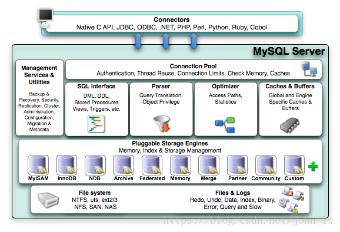

# (一）架构问题

## 1.谈一下MYSQL架构，都由哪些组成？一条SQL大概的执行流程是什么？

首先看看MySQL架构图：




图示一条查询SQL大概执行流程，来源于《高性能MySQL 第3版》


1. 客户端发送一条查询给服务器
2. 服务器先检查查询缓存，如果命中了缓存，则立刻返回存储在缓存中的结果。否则进入下一阶段
3. 服务器端进行SQL解析、预处理，再由优化器生成对应的执行计划。
4. MySQL根据优化器生成的执行计划，调用存储引擎的API执行查询
5. 将结果返回给客户端

更多详细介绍，参照这篇文章：[MySQL架构及组成介绍](https://github.com/asdbex1078/MySQL/blob/master/mysql-optimization/mysql%E6%9E%B6%E6%9E%84%E2%80%94%E2%80%94%E6%9E%B6%E6%9E%84%E5%8F%8A%E4%BB%8B%E7%BB%8D.md#mysql%E6%9E%B6%E6%9E%84%E5%8F%8A%E7%BB%84%E6%88%90%E4%BB%8B%E7%BB%8D)

## 2. MySQL本身是有缓存的，为什么不建议使用MySQL本身的缓存，反而使用Redis、Memcache？

关于MySQL缓存介绍，可以参考[这里](https://github.com/asdbex1078/MySQL/blob/master/mysql-optimization/mysql%E6%9E%B6%E6%9E%84%E2%80%94%E2%80%94%E6%9E%B6%E6%9E%84%E5%8F%8A%E4%BB%8B%E7%BB%8D.md#7%E7%BC%93%E5%AD%98%E4%B8%BB%E4%BB%B6caches--buffers)

跟Redis、Memcache相比：

1. 占用内存方面：
   - MySQL缓存占用的是本机服务器的内存，对于InnoDB来说，本身就很吃内存，再加上最外层的缓存机制，及其耗费性能。
   - redis、memcache可以不用跟MySQL同一台服务器，相对来说，为MySQL的高效运行节省了内存

2. 缓存同步问题：
   - MySQL缓存只是在一台机器上的缓存，不会同步到其他机器上，哪怕主从复制也不会同步缓存
   - Redis、memcache可以分布式部署，同步缓存
3. 缓存内容重复问题
   - MySQL中，sql语句的注释，空格，大小写都会被认为是不同的SQL，从而缓存的内容会重复
   - Redis、memcache相对灵活，可以自定义key。如可以根据功能来定义key，缓存内容就不会重复
4. 高可用问题（实际上就是问题2）
   - MySQL缓存不会同步，导致无法高可能
   - Redis、Memcache可以分布式部署，可实现高可用

## 3. InnoDB缓冲池里面有缓存，而且经常用，上边不是说MySQL不建议使用缓存吗？

首先，需要考虑一个问题：

- 缓冲 - buffer：在计算机领域，缓冲器指的是缓冲寄存器，它分输入缓冲器和输出缓冲器两种。前者的作用是将外设送来的数据暂时存放，以便处理器将它取走；后者的作用是用来暂时存放处理器送往外设的数据。**有了数控缓冲器，就可以使高速工作的CPU与慢速工作的外设起协调和缓冲作用，实现数据传送的同步。**由于缓冲器接在数据总线上，故必须具有三态输出功能。
- 缓存 - cache：缓存是指可以进行高速[数据](https://baike.baidu.com/item/数据)交换的[存储器](https://baike.baidu.com/item/存储器)，它先于[内存](https://baike.baidu.com/item/内存)与[CPU](https://baike.baidu.com/item/CPU)交换数据，因此[速率](https://baike.baidu.com/item/速率)很快。L1 Cache([一级缓存](https://baike.baidu.com/item/一级缓存))是CPU第一层[高速缓存](https://baike.baidu.com/item/高速缓存)。内置的[L1高速缓存](https://baike.baidu.com/item/L1高速缓存)的容量和结构对CPU的性能影响较大，不过[高速缓冲存储器](https://baike.baidu.com/item/高速缓冲存储器)均由静态RAM组成，结构较复杂，在CPU管芯面积不能太大的情况下，L1级高速缓存的容量不可能做得太大。一般L1缓存的容量通常在32—256KB。L2　Cache([二级缓存](https://baike.baidu.com/item/二级缓存))是CPU的第二层[高速缓存](https://baike.baidu.com/item/高速缓存)，分内部和外部两种芯片。内部的芯片[二级缓存](https://baike.baidu.com/item/二级缓存)运行[速率](https://baike.baidu.com/item/速率)与[主频](https://baike.baidu.com/item/主频)相同，而外部的二级缓存则只有主频的一半。L2[高速缓存](https://baike.baidu.com/item/高速缓存)容量也会影响CPU的性能，原则是越大越好，普通[台式机](https://baike.baidu.com/item/台式机)CPU的L2缓存一般为128KB到2MB或者更高，笔记本、[服务器](https://baike.baidu.com/item/服务器)和[工作站](https://baike.baidu.com/item/工作站)上用CPU的L2高速缓存最高可达1MB-3MB。由于高速缓存的速度越高价格也越贵，故有的计算机系统中设置了两级或多级高速缓存。紧靠[内存](https://baike.baidu.com/item/内存/103614)的一级高速缓存的速度最高，而容量最小，二级高速缓存的容量稍大，速度也稍低。

**一言以蔽之：缓存（cache）是在读取硬盘中的数据时，把最常用的数据保存在内存的缓存区中，再次读取该数据时，就不去硬盘中读取了，而在缓存中读取。缓冲（buffer）是在向硬盘写入数据时，先把数据放入缓冲区,然后再一起向硬盘写入，把分散的写操作集中进行，减少磁盘碎片和硬盘的反复寻道，从而提高系统性能。**

然后，InnoDB架构中，有非常重要的一个部分——**缓冲池**。该缓冲池需要占用服务器内存，且**专用于MySQL的服务器，建议把80%的内存交给MySQL。**

简单看一下缓冲池的作用：

1. **缓存数据页。将本次查询所需要的数据页，加载到缓冲池中，再从缓冲池中查找出最终数据。**
2. **利用缓存的数据页，节省从磁盘获取数据的IO成本。**
3. 所有的增删改查都是在缓冲池中完成，然后脏页刷盘，进行持久化。
4. 自适应哈希索引等等

由上可以看出，缓冲池有一个缓存的功能。这个缓存，是InnoDB自带的，而且经常会用到。该缓存功能并不是MySQL架构中的缓存组件。这是两者最大的区别。

- **MySQL组件中的缓存**：
  1. 所处位置：MySQL架构中的缓存组件
  2. 缓存内容：缓存的是SQL 和 该SQL的查询结果。如果SQL的大小写，格式，注释不一致，则被认为是不同的SQL，重新查询数据库，并缓存一份数据。
  3. 可否关闭：是可以手动关闭，并卸载该组件的。**
- **InnoDB中的缓存**：
  1. 所处位置：InnoDB架构中的缓冲池
  2. 缓存内容：缓存的是所有需要查找的数据，所在的数据页。
  3. 可否关闭：是InnoDB缓冲池自带的功能，**无法关闭，无法卸载**。如果InnoDB的缓冲池被关闭或卸载，则InnoDB直接瘫痪。所以说缓冲池是InnoDB的最重要的一部分。

不建议使用MySQL的缓存是指，不建议使用MySQL架构中的缓存组件，并不是同时否定了InnoDB中的缓存功能。

# (二）schema问题

## 1. MySQL中，主键自增ID用完了会发生什么问题？该怎么解决？

**发生的问题**：

首先区分存储引擎是什么。

- 如果是 InnoDB ，则内存表对象将包含一个称为自动增量计数器的特殊计数器，该计数器在为该列分配新值时使用。当使用的数据类型达到最大值后，(例如int 最大值2147483647)，下次插入值时，依旧以该最大值进行插入。所以会报错

  ```sql
  1062 - Duplicate entry '2147483647' for key 'tableName.PRIMARY'
  ```

  > 1062：字段值重复，入库失败
  
- 如果是 MYISAM 存储引擎，主键自增ID达到指定类型的最大值后，会报错 

  ```sql
  1264 - Out of range value for column '主键ID' at row 1
  ```

  为什么会不一样？查到了是由于sql_mode造成的。

  1. **sql_mode**是一组mysql支持的基本语法及校验规则

  2. 此时，修改sql_mode，本例以MySQL8.0为主，关键地方是一样的:

     ```sql
     mysql> select @@sql_mode;
     +-----------------------------------------------------------------------------------------------------------------------+
     | @@sql_mode                                                                                                            |
     +-----------------------------------------------------------------------------------------------------------------------+
     | ONLY_FULL_GROUP_BY,STRICT_TRANS_TABLES,NO_ZERO_IN_DATE,NO_ZERO_DATE,ERROR_FOR_DIVISION_BY_ZERO,NO_ENGINE_SUBSTITUTION |
     +-----------------------------------------------------------------------------------------------------------------------+
     1 row in set (0.02 sec)
     
     mysql> set @@sql_mode = 'ONLY_FULL_GROUP_BY,NO_ZERO_IN_DATE,NO_ZERO_DATE,ERROR_FOR_DIVISION_BY_ZERO,NO_ENGINE_SUBSTITUTION';
     Query OK, 0 rows affected (0.00 sec)
     
     # 再次执行插入sql操作，（myisam引擎，表中已有主键ID最大值）
     # 报错跟 InnoDB 表一致
     1062 - Duplicate entry '2147483647' for key 'tableName.PRIMARY'
     ```

     

  3. 去掉 sql_mode 中的 `STRICT_TRANS_TABLES`，发现myisam报错与 InnoDB一致。

  4. `STRICT_TRANS_TABLES`:为事务性存储引擎以及可能的情况下为非事务性存储引擎启用严格的SQL模式。
     innodb存储引擎（支持事务）
     myisam存储引擎（不支持事务）
     对于innodb存储引擎来说当设置sql_mode有该值时，当发现插入数据无法正常插入，会报错，并且回滚所有参数（假如一个插入操作往数据表中插入10行数据，但是在第五行数据不能插入，此时会终止插入操作并且会回滚插入成功的数据）
     对于myisam存储引擎：当插入数据是第一行无法插入时，**报错并且回滚插入数据**。当插入的数据不是第一行无法插入时，此时**MySQL将无效值转换为该列的最接近的有效值，并插入调整后的值。如果缺少值，MySQL将为列数据类型插入隐式默认值。无论哪种情况，MySQL都会生成警告而不是错误，并继续处理该语句。**

     ***也就是说，开启该参数，sql模式比较严格，MAX_INT + 1 触发了该模式。关闭之后，以 MAX_INT 方式插入，造成键值重复。***

  5. 关于更多sql_mode，参考官网：[server sql mode](https://dev.mysql.com/doc/refman/8.0/en/sql-mode.html#sql-mode-strict)


**其次解决方案**：

1. 常规情况下自增主键的数据类型：

   |     类型     |  大小   |                     范围（有符号）                      |         范围（无符号）          |    用途    |
   | :----------: | :-----: | :-----------------------------------------------------: | :-----------------------------: | :--------: |
   |   TINYINT    | 1 byte  |                       (-128，127)                       |            (0，255)             |  小整数值  |
   |   SMALLINT   | 2 bytes |                    (-32 768，32 767)                    |           (0，65 535)           |  大整数值  |
   |  MEDIUMINT   | 3 bytes |                 (-8 388 608，8 388 607)                 |         (0，16 777 215)         |  大整数值  |
   | INT或INTEGER | 4 bytes |             (-2 147 483 648，2 147 483 647)             |       (0，4 294 967 295)        |  大整数值  |
   |    BIGINT    | 8 bytes | (-9,223,372,036,854,775,808，9 223 372 036 854 775 807) | (0，18 446 744 073 709 551 615) | 极大整数值 |

   常用的是 int，且是有符号的 int ，所以范围 是 (-2 147 483 648，2 147 483 647)，可以尝试修改字段为无符号，`UNSIGNED`

   可扩大约二倍的范围。加上MySQL一张表，数据量过亿便性能变差，所以有符号的int是完全够用的。

2. 使用更大的数据类型，BIGINT 

3. 分库分表，根据主键ID进行分表，分表策略可以自定义，如按区间分表，按值取模分表等。

4. 将主键id变成 varchar 类型，失去了自增属性

5. 采用分布式ID，如雪花算法等，转成varchar类型绝对够用

## 2. count(1) 和 count(*) 相比有什么差异？与count(列名) 相比呢？

- **1️⃣. 对于 InnoDB 来说**

  1. count(1) 和 count(\*) 一般用来统计全表数据量或指定条件的总数量，包含null值。count(列名)只会统计该列不为null的总数。
     **所以数量上count(1) = count(*) >= count(列名)。**
  2. 从MySQL5.7开始，提供了追踪优化器功能。优化器在优化SQL之前，即准备阶段，就把 count(\*) 格式化成 count(0)。(MySQL5.6、5.7、8.0官网也有明确说明，性能是一样的)
     但是，count(列名) 并没有优化成其他方式，而且要去掉null值，所以占用了一部分性能。
     **所以性能上 count(1) = count(*) > count(列名有索引) > count(列名无索引)**

  **案例：**

  通过案例来测试一下count(*)，count(1)，count(field)的性能差异，MySQL版本为5.7.19，测试表是一张sysbench生成的表，表名sbtest1，总记录数2411645，如下：

  ```sql
  CREATE TABLE sbtest1 (
  id int(11) NOT NULL AUTO_INCREMENT,
  k int(11) DEFAULT NULL,
  c char(120) NOT NULL DEFAULT '',
  pad char(60) NOT NULL DEFAULT '',
  PRIMARY KEY (id),
  KEY k_1 (k)
  ) ENGINE=InnoDB;
  
  测试SQL语句：
  select count(*) from sbtest1;
  select count(1) from sbtest1;
  select count(id) from sbtest1;
  select count(k) from sbtest1;
  select count(c) from sbtest1;
  select count(pad) from sbtest1;
  
  针对count()、count(1)和count(id)，加了强制走主键的测试，如下：
  select count() from sbtest1 force index(primary);
  select count(1) from sbtest1 force index(primary);
  select count(id) from sbtest1 force index(primary);
  
  ```

  **汇总测试结果：**对不同的测试SQL，收集了profile，发现主要耗时都在Sending data这个阶段，记录Sending data值。

  | 类型                | 耗时(s) | 索引        | Sending data耗时(s) |
  | :------------------ | :------ | :---------- | :------------------ |
  | count(*)            | 0.47    | k_1         | 0.463624            |
  | count(1)            | 0.46    | k_1         | 0.463242            |
  | count(id)           | 0.52    | k_1         | 0.521618            |
  | count(*)强制走主键  | 0.54    | primay key  | 0.538737            |
  | count(1)强制走主键  | 0.55    | primary key | 0.545007            |
  | count(id)强制走主键 | 0.60    | primary key | 0.598975            |
  | count(k)            | 0.53    | k_1         | 0.529366            |
  | count(c)            | 0.81    | NULL        | 0.813918            |
  | count(pad)          | 0.76    | NULL        | 0.762040            |

  **结果分析：**

  1. 从以上测试结果来看，count(\*)和count(1)性能基本一样，默认走二级索引(k_1)，性能最好，这也验证了count(*)和count(1)在InnoDB内部处理方式一样。
  2. count(id) 虽然也走二级索引(k_1)，但是性能明显低于count(\*)和count(1)，因为要处理不为 null 的值。
  3. 强制走主键索引时，性能反而没有走更小的二级索引好，InnoDB存储引擎是索引组织表，行数据在主键索引的叶子节点上，走主键索引扫描时，处理的数据量比二级索引更多，所以性能不及二级索引。
  4. count(c)和count(pad)没有走索引，性能最差，但是明显count(pad)比count(c)好，因为pad字段类型为char(60)，小于字段c的char(120)，尽管两者性能垫底，但是字段小的性能相对更好些。

  

  >  count(*)延伸
  >
  > - 在5.7.18版本之前，InnoDB处理select count(*) 是通过扫描聚簇索引，来获取总记录数。
  > - 从5.7.18版本开始，InnoDB扫描一个最小的可用的二级索引来获取总记录数，或者由SQL hint来告诉优化器使用哪个索引。如果二级索引不存在，InnoDB将会扫描聚簇索引。
  >
  > 执行select count(*)在大部分场景下性能都不会太好，尤其是表记录数特别大的情况下，索引数据不在buffer pool里面，需要频繁的读磁盘，性能将更差。
  >
  > 
  >
  >  count(*)优化思路
  >
  > 1. 一种优化方法，是使用一个统计表来存储表的记录总数，在执行DML操作时，同时更新该统计表。这种方法适用于更新较少，读较多的场景，而对于高并发写操作，性能有很大影响，因为需要并发更新热点记录。
  > 2. 如果业务对count数量的精度没有太大要求，可使用show table status中的行数作为近似值。
  >
  > 
  >
  > 该案例来源于：[MySQL count(*),count(1),count(field)区别](https://www.mytecdb.com/blogDetail.php?id=81)

  ---

  **2️⃣. 对于 MYISAM 来说**

  1. Myisam表中，只执行 select count(\*) from table，没有任何条件，没有任何其他返回值。则会很快返回总行数。
     因为Myisam引擎存储了精确的行数，并且可以非常快速地返回总行数。当只有在第一列定义为NOT NULL时，COUNT(1)才会跟count(*)一样。
  2. MYISAM 的count(\*) 性能高于 InnoDB的count(*).由于 MVCC 多版本并发控制，InnoDB中不能保存精确的总行数

